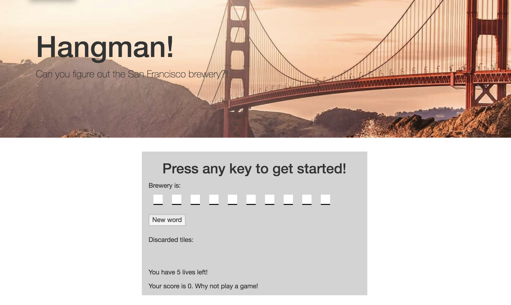
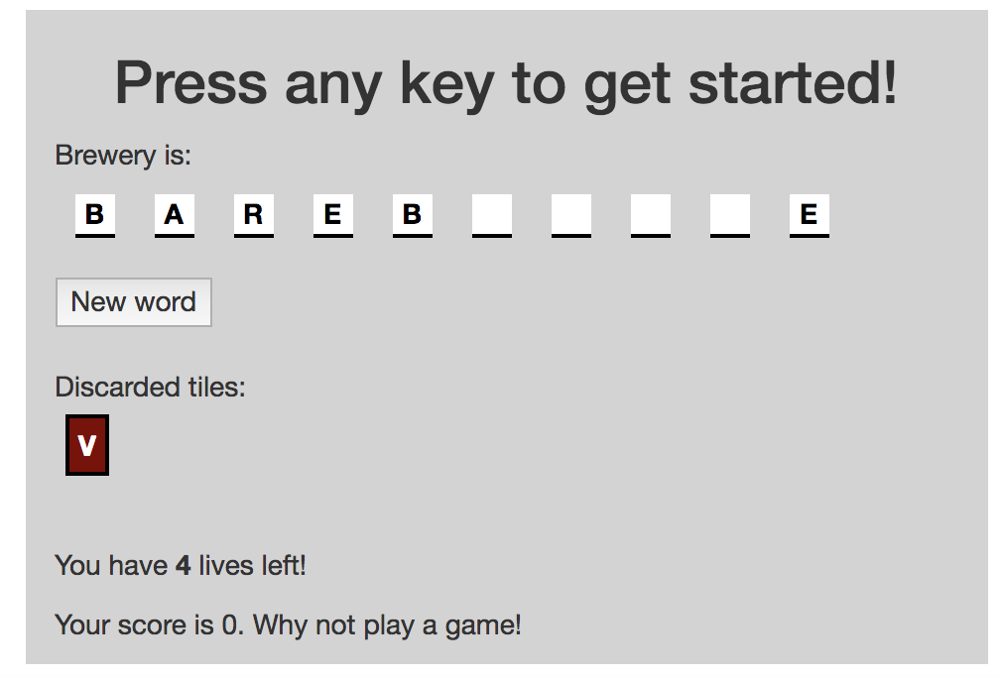
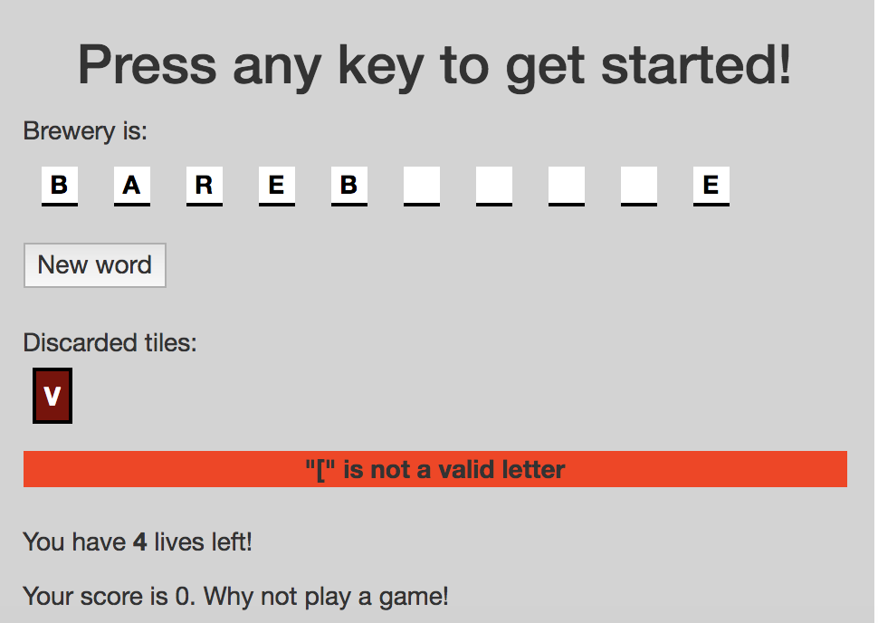
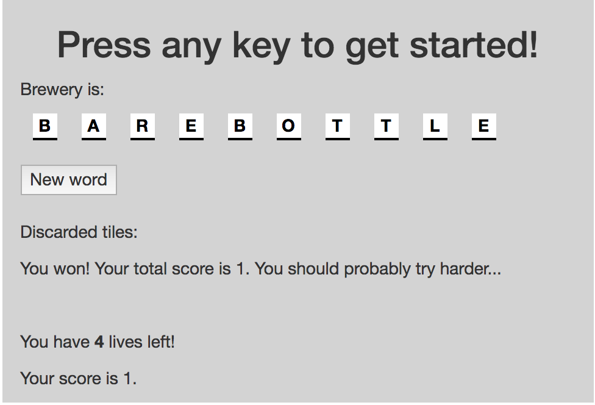
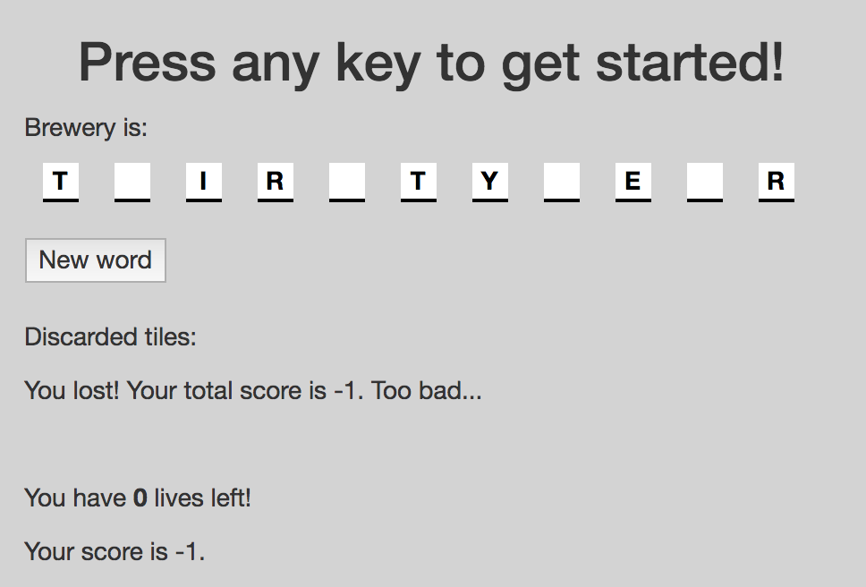

# Hangman

### Objective
Build a Hangman game using Javascript and HTML/CSS. 
Game is deployed [here](https://sashikers.github.io/Hangman-Game/). 

### The Game
On loading, the user sees this: 

As the user presses keys on their keyboard, if the guess is correct, the letter gets revealed in the letter, or if incorrect, the letter get placed into the reject pile. 

If the letter guess is not valid (non-alphabetical characters), the user gets an error message but does not lose a life. 

If the letter has already been guessed, the user does not lose a life, but does get a notification. 

If the user correctly guesses the word, the user's score goes up by 1, and the user has the option to try another word. 

If the user cannot guess the word correctly in the span of 5 guesses, the user's score goes down by 1, discarded tiles are emptied, and the user has the option of getting another word. 

